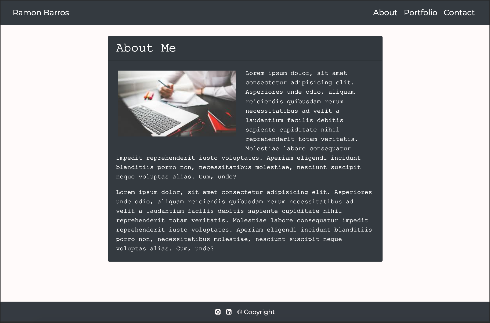
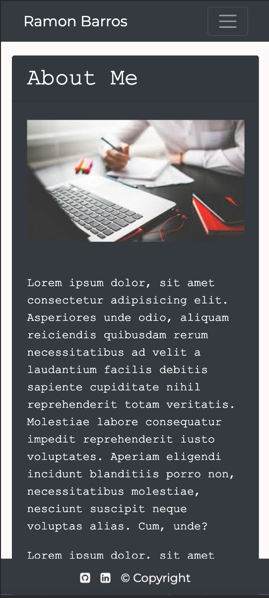

# Responsive Portfolio
> Responsive website with design that ensures that web applications render well on a variety of devices or screen sizes. 

## Table of contents
* [General info](#general-info)
* [Screenshots](#screenshots)
* [Technologies](#technologies)
* [Setup](#setup)
* [Features](#features)
* [Status](#status)
* [Inspiration](#inspiration)
* [Contact](#contact)

## General info
This project uses the Bootstrap CSS Framework as well as its own css file with a purpose of creating a mobile responsive portfolio. Examples of Bootstrap's grid system (containers, rows, and columns) can be found in it. The motivation to start this project was to showcase HTML and CSS skills that accomplish the main goal of creating a responsive portfolio.

## Screenshots

## Technologies
* HTML 5
* CSS
* Bootstrap 4.4

## Setup
Repository can be found here: [GitHub/ramonpbarros](https://github.com/ramonpbarros/responsive-website)
Make sure to git clone repository and check out the code!

## Code Examples
Examples of Bootstrap's grid system usage:
`   
 `
`       
`
`          `
`       
`
`   
`

## Features
List of features:
* About me tab, responsive.
* Portfolio tab with grid containing 5 images, responsive.
* Contact tab using Bootstrap's form, responsive.  

To-do list for future development:
* Add banners to images on portfolio's tab.
* Give action on click to these banners and direct user to different projects.
* Get input from contact form and use it.

## Status
Project is: _in progress_
* Checkout deployed version [here](https://ramonpbarros.github.io/responsive-website/).

## Inspiration
Project inspired by UCSD Coding Bootcamp, based on first week of course, applying HTML and CSS skills.

## Contact
Created by [@ramonpbarros](https://github.com/ramonpbarros) - feel free to contact me!